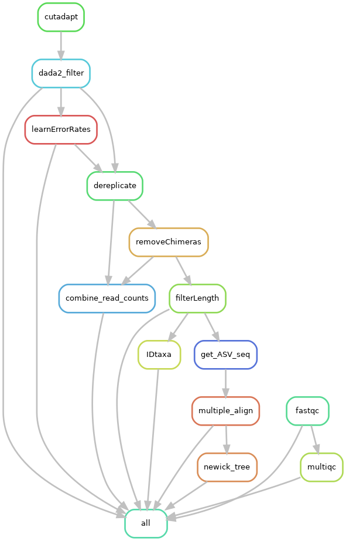

Amplicon sequencing DADA2 snakemake workflow

[](https://snakemake.bitbucket.io)
[](https://benjjneb.github.io/dada2/index.html)
[](https://docs.conda.io/en/latest/)


This is a snakemake workflow for profiling composition of microbial communities from amplicon sequencing
data (16s, with slight modifications for 18s and ITS)  using dada2.


## Overview

Input: 
* Raw paired-end fastq files
* samples.tsv [example](samples.tsv)

Output:

* Taxonomic assignment tables for specified databases (GTDB, RDP, SILVA).
* ASV abundance table (seqtab_nochimera.rds, seqtab_fitlerLength.rds)
* ASV sequences in a fasta file from seqtab_nochimera.rds
* Summary of reads filtered at each step (Nreads.tsv)


Output:

* Taxonomic assignment tables for specified databases (GTDB,RDP,SILVA).
* ASV abundance table (seqtab_nochimera.rds, seqtab_fitlerLength.rds)
* ASV sequences in a fasta file from seqtab_nochimera.rds
* Summary of reads filtered at each step (Nreads.tsv)


## Pipeline summary




## How to Use

1. Please make sure you have installed conda (miniconda) before running this workflow.


2. Use prepare.py to generate samples.tsv. 
 ``` prepare.py <DIR> ```
<DIR> is the location of the raw fastq files.

Config file

3. Include the correct primer sequences in config.yaml 

4. Make sure you modify TRUNC and Trim parameters for DADA2's filter function in config.yaml

5. Download the taxonomy databases from http://www2.decipher.codes/Downloads.html  that you plan to use in utils/databases/.

6. Once confident with all the parameters you can run
 ``` snakemake --use-conda --cores THREADS ```
  
If you plan to run it the cluster, 


Output files and logs

All logs are placed in output/logs

Important result files:
 output/dada2
      seqtab_nochimeras.rds
      seqtab_filterLength.rds
      Nreads.tsv
 output/taxonomy
    <DATABASE>.tsv
    ASV_seq.fasta
    ASV_tree.nwk
