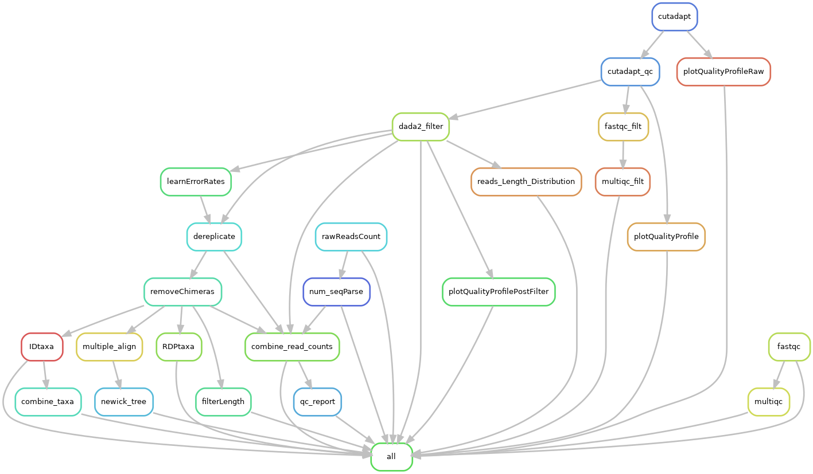

# Amplicon sequencing DADA2 snakemake workflow

[](https://docs.conda.io/en/latest/)
[](https://snakemake.bitbucket.io)
[](https://benjjneb.github.io/dada2/index.html)


This is a snakemake workflow for profiling microbial communities from amplicon sequencing
data using dada2. DADA2 tutorial can be found from https://benjjneb.github.io/dada2/index.html. The initial code was cloned from https://github.com/SilasK/amplicon-seq-dada2 and modified to make a workflow suitable for our needs.

<br>

## Overview

Input: 
* Raw paired-end fastq files
* samples.tsv [example](example_files/samples.tsv)

Output:

* Taxonomic assignment tables for specified databases (GTDB, RDP, SILVA, URE).
* ASV abundance table (seqtab_nochimera.rds).
* ASV sequences in a fasta file from seqtab_nochimera.rds (ASV_seq.fasta).
* Summary of reads filtered at each step (Nreads.tsv).
* A phylogenetic tree (ASV_tree.nwk).

<br> 

## Pipeline summary



<br> 

## Workflow

<details>
<summary><h3 style="font-size: 24px;">1. Prerequisites</h3></summary>
    
Please install the following tools before running this workflow.

conda (miniconda): https://conda.io/projects/conda/en/stable/user-guide/install/linux.html

snakemake: https://snakemake.readthedocs.io/en/stable/getting_started/installation.html

</details>


<details>
<summary><h3 style="font-size: 24px;">2. Setting up environments</h3></summary>

Next we need to set up a few environments to use in different steps of the pipeline.

#### 2.1. dada2 environment

To install r and dada2:

```bash
conda create -n dada2 -c conda-forge -c bioconda -c defaults --override-channels bioconductor-dada2
```

To activate the environment and install the required packages (gridExtra, ggplot2, DECIPHER, Biostrings, limma) locally in R:

```bash
conda activate dada2
(dada2) [username@hostname ~]$ R
install.packages("gridExtra")


install.packages("ggplot2")


if (!require("BiocManager", quietly = TRUE))
    install.packages("BiocManager")
BiocManager::install("DECIPHER")


BiocManager::install("Biostrings")

BiocManager::install("limma")

q() #to quit R
conda deactivate
```

#### 2.2. QC environment

To install fastqc, multiQC, cutadapt, and seqkit tools for quality control in a new environment:

```bash
conda create --name QC
conda activate QC
conda install -c bioconda fastqc
conda install -c anaconda pip
pip install multiqc
pip install pandas
conda install -c bioconda cutadapt or pip install cutadapt
conda install -c bioconda seqkit
conda deactivate
```

#### 2.3 fastree_mafft environment 

To create an environment for generating a phylogenetic tree and a fasta file of ASVs:

```bash
conda create -n fastree_mafft
conda activate fastree_mafft
conda install -c bioconda fasttree
conda deactivate
```

#### 2.4 rmd environment

```bash
conda create -n rmd
conda activate rmd
conda install -c conda-forge r-base

(dada2) [username@hostname ~]$ R
install.packages('DT')
install.packages("ggplot2")
install.packages("dplyr")

q() #to quit R

conda deactivate
```

</details>
 

<details>
<summary><h3 style="font-size: 24px;">3. Usage</h3></summary> 

Then please follow these steps to set up and run the pipeline.

#### 3.1 Make sure that all the environments are set up and required packages are installed. To do so, after installing each package, you can run the tool name and the flag -h (i.g. fastqc -h) to see if it is installed.

#### 3.2 Navigate to your project directory and clone this repository into that directory using the following command:

```bash
git clone https://github.com/IMCBioinformatics/dada2_snakemake_workflow.git
```

#### 3.3 Use prepare.py script to generate the samples.tsv file as an input for this pipeline using the following command: 

```<DIR>``` is the location of the raw fastq files.

```bash
python utils/scripts/common/prepare.py <DIR>
```

#### 3.4 Make sure to configure the config.yaml file.

##### 3.4.1 modifying pipeline parameters:
  - path of the input directory
  - name and path of the output directory
  - Forward and reverse reads format

##### 3.4.2 modifying QC parameters:
  - primer sequences (if they are sequenced)
  - primer removal and quality trimming values
  
##### 3.4.3 modifying dada2 parameters:
  - DADA2 filter and trim thresholds
  - chimera removal method
  - number of reads for error rate learning

#### 3.5 Download the taxonomy databases from http://www2.decipher.codes/Downloads.html that you plan to use in utils/databases/ and consequently set the path for them in the config file.

#### 3.6 Once confident with all the parameters first run the snakemake dry run command to make sure that pipeline is working.
 
 ```bash
 snakemake -np
 ```
Then snakemake can be executed by the following bash script:
 
 ```bash
 sbatch dada2_sbatch.sh
 ```
</details>


<details>
<summary><h3 style="font-size: 24px;">4. Output files and logs</h3></summary> 
 
To make sure that the pipeline is run completely, we need to check the log and output files.

#### 4.1 Log files
All logs are placed in the logs directory. 
A copy of all snakemake files and logs will be copied to the output directory (output/snakemake_files/) as well to avoid rewritting them by upcoming re-runs.

#### 4.2 Important result files:
##### 4.2.1 output/dada2
   - seqtab_nochimeras.rds
   - Nreads.tsv
##### 4.2.2 output/taxonomy
   - ```<DATABASE>```.tsv
##### 4.2.3 output/phylogeny    
   - ASV_seq.fasta
   - ASV_tree.nwk
##### 4.2.4 output/QC_html_report
   - qc_report.html
</details>
