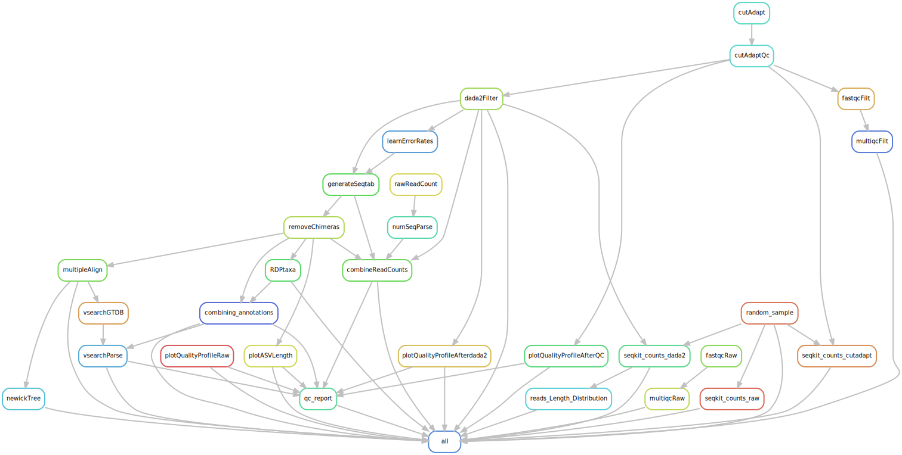

# Amplicon sequencing DADA2 snakemake workflow

[](https://docs.conda.io/en/latest/)
[](https://snakemake.bitbucket.io)
[](https://benjjneb.github.io/dada2/index.html)


This is a snakemake workflow for profiling microbial communities from amplicon sequencing
data using dada2. DADA2 tutorial can be found from https://benjjneb.github.io/dada2/index.html. The initial code was cloned from https://github.com/SilasK/amplicon-seq-dada2 and modified to make a workflow suitable for our needs.

<br>

In the dada2 pipeline, species assignment is accomplished through the application of a naive Bayesian classifier method (https://pubmed.ncbi.nlm.nih.gov/17586664/), where a strict requirement of a 100% nucleotide identity match between the reference sequences and the query is employed. To enhance the adaptability of the species assignment process, we leveraged an established tool to adjust the identity threshold to 99.3% (modifiable).
VSEARCH, an open-source alternative to the widely utilized USEARCH tool, is employed in this context. VSEARCH excels in performing optimal global sequence alignments for the query against potential target sequences.
For a more comprehensive understanding of this methodology, please refer to the paper available at https://www.ncbi.nlm.nih.gov/pmc/articles/PMC5075697/.

<br>

## Overview

Input: 
* Raw paired-end fastq files
* samples.tsv [example](example_files/samples.tsv)

Output:

* Taxonomic assignment tables using RDP classifier (by GTDB, RDP, and SILVA databases), in addition to VSEARCH (by GTDB database).
* ASV abundance table (seqtab_nochimera.rds).
* ASV sequences in a fasta file from seqtab_nochimera.rds (ASV_seq.fasta).
* Summary of reads filtered at each step (Nreads.tsv).
* A phylogenetic tree (ASV_tree.nwk).

<br> 

## Pipeline summary



<br> 

## Steps:

1-	**Cutadapt**: primer removal (if needed) and quality trimming of the reads.
<br>
<br> 

2-	**DADA2**: filtering and trimming reads for quality, dereplicating for reducing computational complexity, estimating error rate to distinguish true biological variants, sample inference identifying true sequences and fixing errors, merging paired-end reads, removing chimera and finally assigning taxonomy (using naive Bayesian classifier method with a 100% nucleotide identity match between the reference sequences and the query) and constructing a phylogenetic tree.
<br> 
<br> 

3-	**VSEARCH**: assigning taxonomy by performing optimal global sequence alignments for the query against potential target sequences with an adjustable identity threshold (pipeline default: 99.3%).
<br> 
<br> 

Note: Results from different tools such as fastqc, multiQC, seqkit, and dada2 were employed for quality control assessment at different points of the pipeline.

<br> 


## Workflow

<details>
<summary><h3 style="font-size: 24px;">1. Prerequisites</h3></summary>
    
Please install the following tools before running this workflow. Please request an interactive session before starting the installation step by running the following command:

```bash
    salloc --mem=20G --time=05:00:00
```

conda (miniconda): 
https://conda.io/projects/conda/en/stable/user-guide/install/linux.html

snakemake: 
```bash
conda activate base

conda install -c conda-forge mamba

mamba create --name snakemake

mamba activate snakemake

mamba install -c conda-forge -c bioconda snakemake==7.32.4

pip install pyyaml
```


</details>


<details>

<summary><h3 style="font-size: 24px;">2. Setting up environments</h3></summary>

Note: 

**You can replace conda with mambe in the following commands. Mamba is a drop-in replacement and uses the same commands and configuration options as conda. You can swap almost all commands between conda & mamba. Mamba is faster than conda in resolving package dependencies and creating or updating environments.**

After installation, verify the installation of each tool by executing its name followed by the flag '-h'. For example, use fastqc -h to check if FastQC is installed. This command should display the help information or usage instructions for the tool, indicating successful installation.

For packages installed in R, initiate an R session within the same environment. Confirm the package installation by executing the library("package name") command, replacing "package name" with the actual name of the package. This will load the package in R, showing that it is properly installed and accessible in the current environment.

Next we need to set up a few environments to use in different steps of the pipeline.

#### 2.1. dada2 environment

To install r and dada2:

```bash
conda create -n dada2 -c conda-forge -c bioconda -c defaults --override-channels bioconductor-dada2
```

To activate the environment and install the required packages (dplyr, gridExtra, ggplot2, DECIPHER, Biostrings, limma) locally in R:

```bash
conda activate dada2
```

to open an R session within the dada2 environment type R, (dada2) [username@hostname ~]$ R


```bash
install.packages("gridExtra")
install.packages("ggplot2")
install.packages("dplyr")
if (!require("BiocManager", quietly = TRUE))
    install.packages("BiocManager")
BiocManager::install("DECIPHER")
BiocManager::install("Biostrings")
BiocManager::install("limma")
```

to quit R type q(), (dada2) [username@hostname ~]$ q() and deactivate the environment:

```bash
conda deactivate
```

<br>

#### 2.2. QC environment

To install fastqc, multiQC, cutadapt, and seqkit tools for quality control in a new environment:

```bash
conda create --name QC
conda activate QC
conda install -c bioconda fastqc==0.11.8
conda install pip
pip install multiqc
pip install pandas==1.5.3
pip install cutadapt
conda install -c bioconda seqkit
conda deactivate
```

<br>

#### 2.3 fastree_mafft environment 

To create an environment for generating a phylogenetic tree and a fasta file of ASVs:

```bash
conda create -n fastree_mafft
conda activate fastree_mafft
conda install -c bioconda fasttree
conda deactivate
```

<br>

#### 2.4 rmd environment

```bash
conda create -n rmd
conda activate rmd
conda install -c conda-forge r-base
conda install -c conda-forge pandoc
conda install -c conda-forge r-tidyverse
wget https://github.com/marbl/Krona/releases/download/v2.8.1/KronaTools-2.8.1.tar 
tar xf KronaTools-2.8.1.tar 
cd KronaTools-2.8.1
#prefix destination path is relative to where KronaTools-2.8.1 is downloaded
./install.pl --prefix=/path/where/rmd/environment/is/ #e.g.: /softwares/miniconda/envs/rmd/

```

to open an R session within the rmd environment type R, (rmd) [username@hostname ~]$ R

```bash
install.packages('DT')
install.packages("ggplot2")
install.packages("dplyr")
if (!require("BiocManager", quietly = TRUE))
    install.packages("BiocManager")
BiocManager::install("phyloseq") #This takes a while
install.packages("remotes")
remotes::install_github("cpauvert/psadd")
BiocManager::install("dada2")
BiocManager::install("limma")
BiocManager::install("kableExtra")
install.packages("RColorBrewer")
install.packages("ggpubr")
install.packages("waterfalls")
```

to quit R type q(), (rmd) [username@hostname ~]$ q() and deactivate the environment:

```bash
conda deactivate
```

<br>

#### 2.5 vsearch environment

```
conda create -n vsearch
conda activate vsearch
conda install -c "bioconda/label/cf201901" vsearch
conda deactivate
```

</details>
 

<details>
<summary><h3 style="font-size: 24px;">3. Usage</h3></summary> 

Then please follow these steps to set up and run the pipeline.

#### 3.1 Make sure that all the environments are set up and required packages are installed.
<br>

#### 3.2 Navigate to your project directory and clone this repository into that directory using the following command:
<br>

```bash
git clone https://github.com/IMCBioinformatics/dada2_snakemake_workflow.git
```

#### 3.3 Use prepare.py script to generate the samples.tsv file as an input for this pipeline using the following command: 
<br>

```<DIR>``` is the location of the raw fastq files.

```bash
python utils/scripts/common/prepare.py <DIR>
```

#### 3.4 Make sure to configure the config.yaml file.
<br>

| Parameter | Description | Example/Default |
| -------------- | --------------- | ------------ |
| input_dir | path of the input directory | "/home/data" |
| output_dir | name and path to the output directory | "output" |
| path | path to the main snakemake directory | "/home/analysis/dada2_snakemake_workflow" |
| forward_read_suffix, reverse_read_suffix | Forward and reverse reads format | "_R1" "_R2" |
| primer_removal | Set to TRUE to remove primers | False |
| fwd_primer | Forward primer sequence | "CTGTCTCTTAT..." |
| rev_primer | Reverse primer sequence | "CTGTCTCTTAT..." |
| fwd_primer_rc | Forward primer reverse complement sequence | "CTGTCTCTTAT..." |
| rev_primer_rc | Reverse primer reverse complement sequence | "CTGTCTCTTAT..." |
| min_overlap | minimum overlap length for primer detection | 3 |
| max_e | maximum error rate allowed in primer match/detection | 0.1 |
| qf, qr | quality trimming score | numeric e.g. 20 |
| min_len | minimum length of reads kept | numeric e.g. 50 |
| random_n | number of random samples to look into their reads length distribution | numeric e.g. 5 |
| Positive_samples | Positive control samples to visualize in qc report | "pos_ctrl_1|pos_ctrl_2" |
| threads | number of threads to be used | numeric e.g. 20 |
| truncLen | trimming reads at this length | numeric e.g. 260 |
| maxEE | maximum number of “expected errors” allowed in a read | numeric e.g. 2 |
| truncQ | Truncating reads at the first instance of a quality score less than or equal to truncQ | 2 |
| learn_nbases | minimum number of total bases to use for error rate learning | 1e8 |
| chimera_method | method used for chimera detection | consensus |
| Identity | minimum percent identity for a hit to be considered a match | percentage e.g. 0.993 |
| Maxaccepts | maximum number of hits to consider per query | numeric e.g. 30 |
| RDP_dbs, vsearch_DBs | databases used for taxonomy assignment | |

<br>

#### 3.5 Download the taxonomy databases from http://www2.decipher.codes/Downloads.html that you plan to use in utils/databases/ and consequently set the path for them in the config file

#### 3.6 Once confident with all the parameters first run the snakemake dry run command to make sure that pipeline is working.
 <br>

 ```bash
 snakemake -np
 ```
Then snakemake can be executed by the following bash script:
 
 ```bash
 sbatch dada2_sbatch.sh
 ```
</details>


<details>
<summary><h3 style="font-size: 24px;">4. Output files and logs</h3></summary> 
 
To make sure that the pipeline is run completely, we need to check the log and output files.

#### 4.1 Log files
All logs are placed in the logs directory. 
A copy of all snakemake files and logs will be copied to the output directory (output/snakemake_files/) as well to avoid rewritting them by upcoming re-runs.

<br>

#### 4.2 Important result files:


##### 4.2.1 output/dada2
   - seqtab_nochimeras.rds
   - Nreads.tsv

<br>

##### 4.2.2 output/taxonomy
   - GTDB_RDP.tsv
   - RDP_RDP.tsv
   - Silva_RDP.tsv
   - annotation_combined_dada2.txt (results from all 4 databases side by side)
   - vsearch_dada2_merged.tsv (adding vsearch results and merging vsearch and dada2 GTDB taxonomy assignmnets as final annotations)

<br>

##### 4.2.3 output/phylogeny    
   - ASV_seq.fasta
   - ASV_tree.nwk

<br>

##### 4.2.4 output/QC_html_report
   - qc_report.html
</details>
